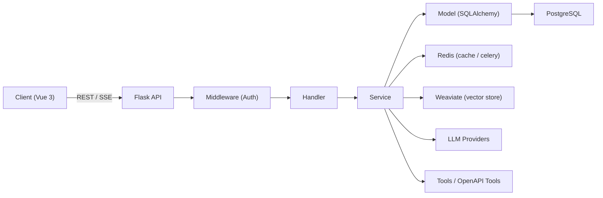

# LLMOps Platform (Agent / RAG / Workflow)

面向 Agent 开发岗与 AI 研发岗的作品集项目：一个企业级 LLM 应用开发与运维平台，覆盖从「模型接入、工具集成、知识库、工作流编排、发布与监控」的全链路能力。

前后端分离：后端 Flask + 前端 Vue 3（TypeScript）。

> UI 场景 Demo：医脉天枢（医疗多智能体会诊/随访/影像分析等）。平台能力本身与行业无关，可复用到通用业务。

## 截图预览

| 应用与编排 | 工作流可视化与调试 |
|---|---|
|  |  |

| 应用编辑器（多智能体/工具/工作流/知识库/记忆） | 用量与成本分析 |
|---|---|
|  |  |

| 知识库文档管理 | 技能库与 Prompt 模板 |
|---|---|
|  |  |

| WebApp 发布 | 影像任务（DICOM 上传与分析结果） |
|---|---|
|  |  |

## 我实现了什么（面试官关心的点）

- Agent 应用：ReAct / Function Calling，支持 SSE 流式输出与事件可视化，支持长记忆与会话管理。
- 多智能体协作：Supervisor 根据任务意图分发子 Agent，支持把「技能、工具、工作流、知识库」组合成可复用的应用能力。
- 工作流编排：基于 Vue Flow 的拖拽式 DAG 设计器，支持节点配置、变量引用、在线调试与结果面板展示（耗时、token 等）。
- 知识库（RAG）：文档上传与解析、分段与启停控制；混合检索（Weaviate 向量检索 + 关键词检索 + 重排序）。
- 工具与技能：内置工具 + OpenAPI 3.0 动态生成工具；技能库、Prompt 模板库用于沉淀“可复制的能力”。
- 发布与监控：WebApp 发布链接；会话反馈；token 吞吐与成本统计分析。
- 业务示例：影像模块支持 DICOM 上传、任务编排与结构化发现展示，用于展示多模态业务落地路径。

## 后端架构速览

后端采用「三层分层架构 + 依赖注入（injector）」：Router/Handler/Service/Model 分离，便于扩展与测试。

- 双蓝图认证：`llmops` 蓝图使用 JWT Bearer Token；`openapi` 蓝图使用 API Key。
- Schema 验证：请求使用 WTForms；响应序列化使用 Marshmallow。
- 异步任务：Celery + Redis（用于文档解析、向量化等耗时任务）。



## 技术栈

- 后端：Python（推荐 3.11）、Flask、SQLAlchemy、Injector、Celery、Redis、PostgreSQL、Weaviate、LangChain/LangGraph。
- 前端：Vue 3、TypeScript、Vite、Pinia、Arco Design、Tailwind CSS、Vue Flow、ECharts、Fetch + SSE。
- 部署：Docker Compose，生产部署与 Nginx 反代配置见 [DEPLOY_DOCKER.md](./DEPLOY_DOCKER.md)。

## 本地启动（推荐开发模式）

更完整的启动说明见 [STARTUP_GUIDE.md](./STARTUP_GUIDE.md)。

如果你在 Windows 上做本地开发，也可以直接使用仓库根目录脚本：`start-local.bat`（本地 PG/Redis + Docker 仅 Weaviate）或 `start-all.bat`（完整栈）。

1. 启动 Weaviate（Docker）

```bash
cd docker/docker
docker-compose -f docker-compose-weaviate-only.yaml up -d
```

2. 启动后端（Flask）

```powershell
cd imooc-llmops-api/imooc-llmops-api-master
python -m venv .venv
.venv\Scripts\Activate.ps1
pip install -r requirements.txt
Copy-Item .env.example .env
python init_db.py
python create_user.py
python -m app.http.app
```

3. 启动 Celery（另开终端）

```powershell
cd imooc-llmops-api/imooc-llmops-api-master
celery -A app.celery worker --loglevel=info --pool=solo
```

4. 启动前端（Vue）

```bash
cd imooc-llmops-ui/imooc-llmops-ui-master
npm install
npm run dev
```

服务默认地址：前端 `http://localhost:5173`，后端 `http://localhost:5000`，Weaviate `http://localhost:8080`。

## 项目结构

```text
LLMops/
  imooc-llmops-api/imooc-llmops-api-master/    # 后端（Flask）
  imooc-llmops-ui/imooc-llmops-ui-master/      # 前端（Vue 3 + TS）
  docker/docker/                               # Docker 编排（Weaviate 等）
  docs/                                        # 文档
  pic/                                         # 截图与素材
```

## 面试可讲的技术点（建议 60 秒讲清）

- LLM 能力工程化：模型提供商统一接入、SSE 流式输出协议与前端解析、对话记忆与会话管理。
- Agent 架构：基于 LangGraph 的状态图编译，事件队列管理（thought/action/message），可中断与可观测。
- 工作流平台化：可视化 DAG 设计器、节点类型扩展、变量系统、调试与发布。
- RAG 工程：文档解析与切分、混合检索、过滤与重排序、索引更新与可用性开关。
- 生产化考虑：双蓝图认证、异步任务、对象存储/向量库/关系库分层、token 成本分析与反馈闭环。
