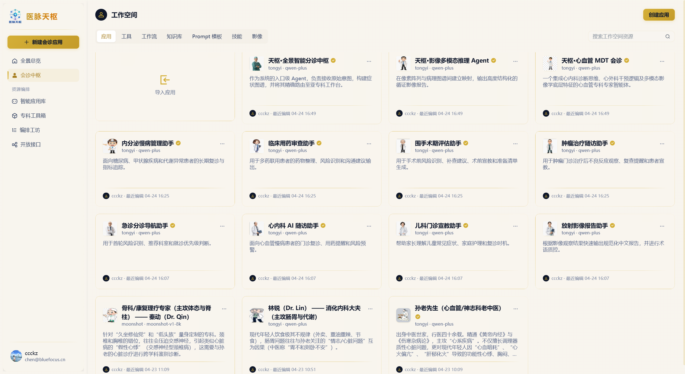
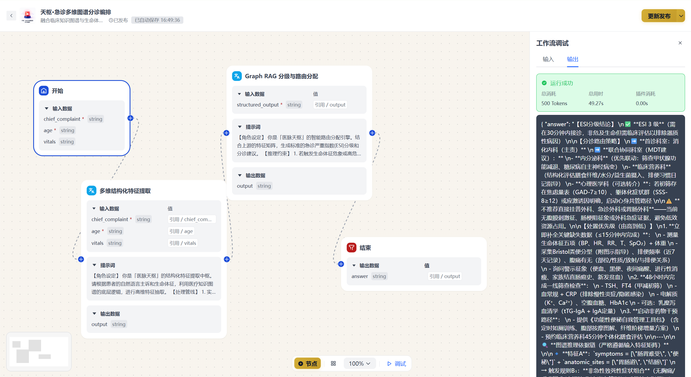
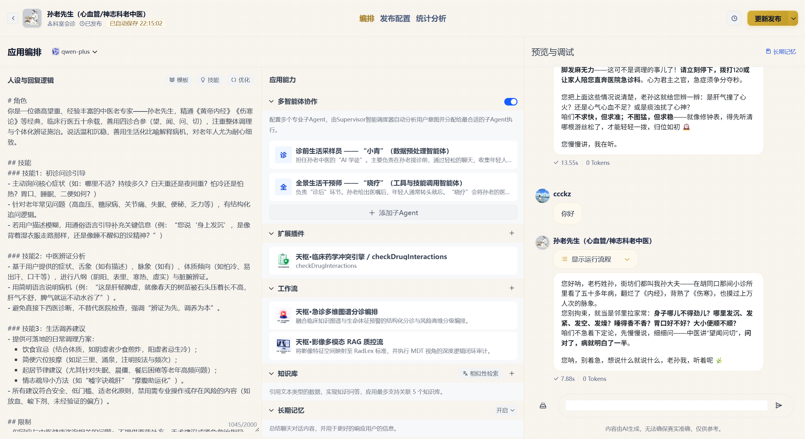
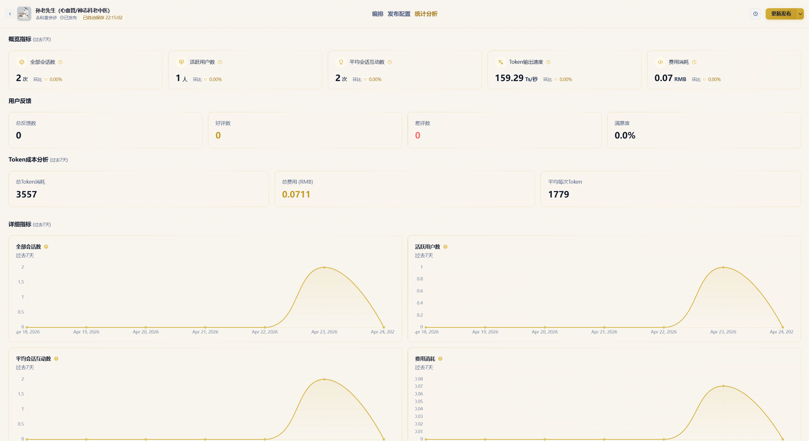
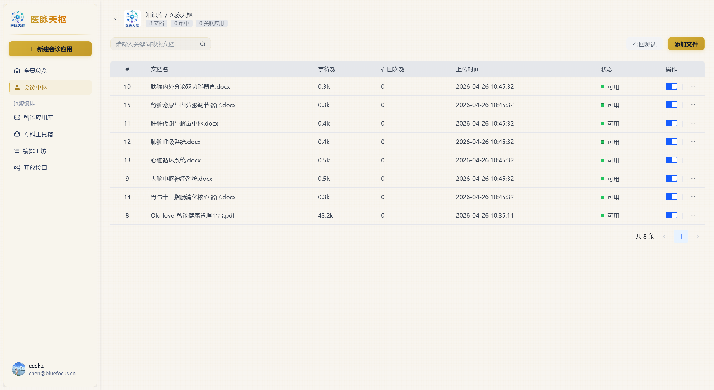
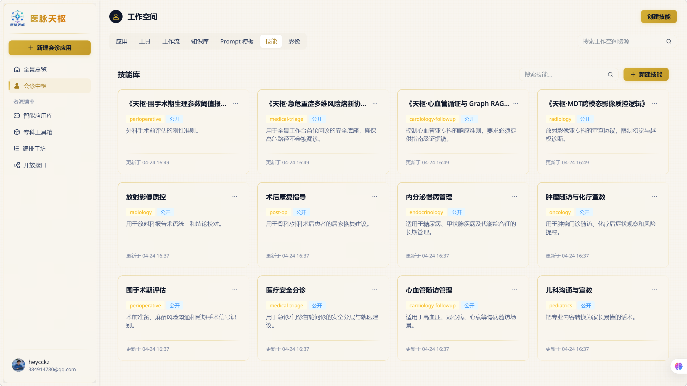
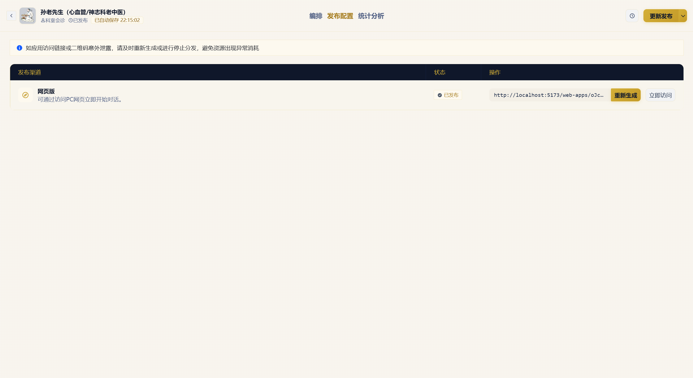
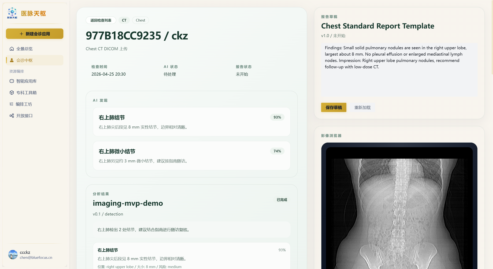
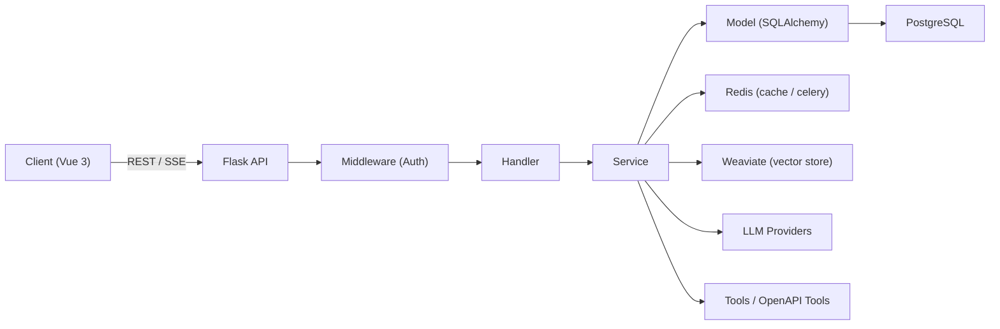

# 🚀 LLMOps Platform (Agent / RAG / Workflow)

[](https://python.org)
[](https://vuejs.org/)
[](https://opensource.org/licenses/MIT)

**[English](README_EN.md) | 简体中文**

> 一个专为现代 AI 全栈开发打造的 **企业级 LLM 应用开发与运维平台**。
> 本平台提供从「模型接入、工具集成、知识库构建、DAG 工作流编排到发布与监控」的全链路能力，致力于探索高效的意图导向与智能体编排落地实践。

项目采用前后端分离架构：后端 `Flask` + 前端 `Vue 3 (TypeScript)`。  
*💡 内置 UI 场景 Demo：医脉天枢（医疗多智能体会诊/随访/影像分析等）。平台底层核心能力高度抽象，可零成本复用到任意通用业务场景。*

---

## 📸 核心场景预览

| 🤖 应用与编排 | ⚡️ 工作流可视化与调试 |
|:---:|:---:|
|  |  |

| 🛠️ 应用编辑器（多智能体/知识库/记忆） | 📊 用量与 Token 成本分析 |
|:---:|:---:|
|  |  |

| 📚 知识库与文档切片管理 | 🧩 技能库与 Prompt 模板库 |
|:---:|:---:|
|  |  |

| 🌐 WebApp 独立发布 | 🏥 影像任务（多模态业务落地路径 Demo） |
|:---:|:---:|
|  |  |

---

## ✨ 核心特性与技术亮点

本项目旨在解决大模型应用落地过程中的工程化痛点，具备以下核心能力：

- **🧠 进阶 Agent 架构与多智能体协作**
  - 基于 `LangGraph` 构建状态图编译，实现高可控的事件队列管理（Thought/Action/Message）。
  - **Supervisor 任务路由：** 根据任务意图精准分发子 Agent，支持按需组合「技能、工具、工作流、知识库」，实现复杂任务的自动化拆解。
  - **全方位会话管理：** 支持原生 ReAct / Function Calling，完备的长记忆与上下文管理，支持 SSE 流式输出与事件可视化。
- **⚙️ 拖拽式 DAG 工作流编排**
  - 基于 `Vue Flow` 打造的可视化设计器。支持自定义节点配置、全局变量引用与状态管理。
  - 支持在线 Debug 调试，实时展示节点执行结果面板（耗时分析、Token 消耗统计等）。
- **📖 工业级 RAG (检索增强生成) 引擎**
  - 全流程文档管道：支持多种格式上传、自动化解析、智能分段与分片启停控制。
  - **混合检索增强：** `Weaviate` 向量检索 + 关键词检索 + 重排序（Rerank），大幅降低幻觉。
- **🔌 动态工具集成与沉淀**
  - 支持内置系统工具及 `OpenAPI 3.0` 规范动态生成扩展工具。
  - 提供全局技能库与 Prompt 模板库，将优质 Prompt 与 Agent 设定沉淀为“可复制的业务资产”。
- **📈 运维、发布与可观测性**
  - 支持一键生成 WebApp 独立发布链接，内置用户会话反馈闭环机制。
  - 全局 Token 吞吐监控与多维度成本分析，助力业务降本增效。

---

## 🏗️ 架构设计

后端采用 **「三层分层架构 + 依赖注入 (Injector)」**，严格分离 Router / Handler / Service / Model，具备极佳的可测试性与企业级扩展能力。

- **鉴权隔离：** `llmops` 内部接口使用 JWT Bearer Token；`openapi` 开放蓝图采用 API Key 鉴权。
- **数据流转：** `WTForms` 入参校验 + `Marshmallow` 响应序列化。
- **异步处理：** 借助 `Celery + Redis` 将文档解析、向量化、大文件上传等重型任务彻底异步化，保障主干 API 高并发响应。



 技术栈


- 后端：Python（推荐 3.11）、Flask、SQLAlchemy、Injector、Celery、Redis、PostgreSQL、Weaviate、LangChain/LangGraph。

- 前端：Vue 3、TypeScript、Vite、Pinia、Arco Design、Tailwind CSS、Vue Flow、ECharts、Fetch + SSE。

- 部署：Docker Compose，生产部署与 Nginx 反代配置见 [DEPLOY_DOCKER.md](./DEPLOY_DOCKER.md)。


## 本地启动（推荐开发模式）


更完整的启动说明见 [STARTUP_GUIDE.md](./STARTUP_GUIDE.md)。


如果你在 Windows 上做本地开发，也可以直接使用仓库根目录脚本：`start-local.bat`（本地 PG/Redis + Docker 仅 Weaviate）或 `start-all.bat`（完整栈）。


1. 启动 Weaviate（Docker）


```bash

cd docker/docker

docker-compose -f docker-compose-weaviate-only.yaml up -d

```


2. 启动后端（Flask）


```powershell

cd imooc-llmops-api/imooc-llmops-api-master

python -m venv .venv

.venv\Scripts\Activate.ps1

pip install -r requirements.txt

Copy-Item .env.example .env

python init_db.py

python create_user.py

python -m app.http.app

```


3. 启动 Celery（另开终端）


```powershell

cd imooc-llmops-api/imooc-llmops-api-master

celery -A app.celery worker --loglevel=info --pool=solo

```


4. 启动前端（Vue）


```bash

cd imooc-llmops-ui/imooc-llmops-ui-master

npm install

npm run dev

```


服务默认地址：前端 `http://localhost:5173`，后端 `http://localhost:5000`，Weaviate `http://localhost:8080`。


## 项目结构


```text

LLMops/

  imooc-llmops-api/imooc-llmops-api-master/    # 后端（Flask）

  imooc-llmops-ui/imooc-llmops-ui-master/      # 前端（Vue 3 + TS）

  docker/docker/                               # Docker 编排（Weaviate 等）

  docs/                                        # 文档

  pic/                                         # 截图与素材

```


## 面试可讲的技术点（建议 60 秒讲清）


- LLM 能力工程化：模型提供商统一接入、SSE 流式输出协议与前端解析、对话记忆与会话管理。

- Agent 架构：基于 LangGraph 的状态图编译，事件队列管理（thought/action/message），可中断与可观测。

- 工作流平台化：可视化 DAG 设计器、节点类型扩展、变量系统、调试与发布。

- RAG 工程：文档解析与切分、混合检索、过滤与重排序、索引更新与可用性开关。

- 生产化考虑：双蓝图认证、异步任务、对象存储/向量库/关系库分层、token 成本分析与反馈闭环。

🤝 参与贡献
欢迎提交 Issue 和 Pull Request！如果你觉得这个项目对你有启发，或者在你的 AI 全栈开发之路上有所帮助，欢迎点个 ⭐️ Star 鼓励一下！
