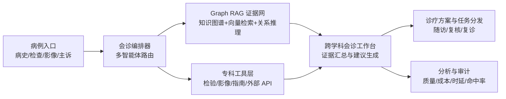

# 医脉天枢：设计编排说明

## 1. 产品定位

医脉天枢是一个融合多智能体编排与 Graph RAG 的跨学科全景会诊中枢，用于把病例、检查、影像、指南、专家经验和工具能力统一纳入同一套会诊工作台。

它不是单纯的问答界面，而是一个面向真实诊疗协作流程的“会诊操作系统”。

## 2. 核心目标

- 让临床输入可以被快速结构化
- 让多角色智能体可以分工协同
- 让证据链可追溯、可引用、可复核
- 让会诊结果可以沉淀为知识和流程资产
- 让知识库、工具、工作流和分析体系形成闭环

## 3. 总体架构

## 4. 能力分层

### 4.1 会诊入口层

- 病例摘要输入
- 检验检查导入
- 影像和文档接入
- 结构化字段抽取

### 4.2 多智能体编排层

- 主协调 Agent
- 专科分诊 Agent
- 证据检索 Agent
- 方案生成 Agent
- 安全审校 Agent

### 4.3 Graph RAG 层

- 结构化知识图谱
- 向量检索与语义召回
- 关系路径推理
- 证据片段溯源

### 4.4 工具与工作流层

- 检验指标解释工具
- 指南查询工具
- 影像与报告解析工具
- MDT 会诊流程编排
- 外部 API 接入

### 4.5 审计与分析层

- 会诊时延
- 检索命中率
- 证据引用覆盖率
- 人工修正率
- 任务完成率

## 5. 前端信息架构

- `home`：全景会诊指挥台
- `space/apps`：会诊应用与智能体编排
- `space/datasets`：图谱、病例库与文档库
- `space/workflows`：会诊工作流编排
- `space/tools` / `store/tools`：专科工具与能力广场
- `analysis`：会诊质量与运营分析
- `openapi`：外部系统对接与接口管理

## 6. 推荐落地顺序

### Phase 1

- 完成品牌重命名
- 重构首页为会诊中枢
- 统一导航命名与视觉语言

### Phase 2

- 建立 Graph RAG 会诊链路
- 补充病例证据聚合和引用
- 打通知识库与会诊页面

### Phase 3

- 引入多智能体分工路由
- 增加专科子 Agent
- 加入安全审校与诊疗建议约束

### Phase 4

- 加强分析看板
- 引入审计留痕
- 形成标准化会诊资产沉淀

## 7. 设计原则

- 先临床流程，后技术炫技
- 先证据闭环，后自动生成
- 先可追溯，后可自动化
- 先可协同，后可规模化

## 8. 下一步建议

优先把首页、侧边栏和会诊应用页统一成“医脉天枢”产品语言，然后再进入 Graph RAG 与多智能体编排的功能增强阶段。
