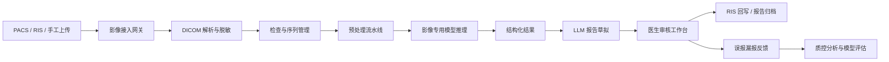

# 医院影像智能处理实施蓝图

## 1. 建设目标

在现有 LLMOps 平台基础上，新增一套面向真实医院业务的影像智能处理能力，优先落地影像科、急诊和临床辅助场景，而不是停留在“上传图片问大模型”的演示层。

平台定位调整为：

- 面向医院私有化部署的 AI 影像辅助处理平台
- 面向影像科医生的报告生成与质控工作台
- 面向运营和质控人员的全链路审计与效果分析系统

## 2. 业务范围

### 2.1 首批落地场景

1. 影像接入与质控
   - 支持 DICOM、JPG、PNG、PDF 报告导入
   - 接入 PACS / RIS / 手工上传三类入口
   - 自动识别检查部位、模态、序列完整性、图像质量

2. 影像结构化解析
   - 解析检查级、序列级和实例级元数据
   - 生成标准化检查摘要，便于后续模型推理和工作流编排

3. AI 辅助检出
   - 第一优先病种建议为胸部 CT 肺结节
   - 第二优先病种建议为急诊头颅 CT 出血筛查
   - 输出病灶位置、置信度、可视化标注和结构化发现

4. 报告草拟
   - 基于 AI 结构化结果、历史报告、院内模板和指南知识库生成报告初稿
   - 医生审核后形成正式报告

5. 知识增强问答
   - 面向影像科医生的指南问答、随访建议查询、模板建议生成
   - 所有回答必须附带来源依据

6. 运营与质控
   - 统计检查量、AI 命中率、报告耗时、医生采纳率、误报漏报反馈
   - 为科主任和质控人员提供可视化看板

### 2.2 明确不在第一阶段的范围

- 直接替代医生出具正式诊断
- 在线自动学习并直接更新正式模型
- 未经合规评估的公网患者影像上传
- 覆盖所有影像模态和病种

## 3. 真实医院业务流程



## 4. 平台能力映射

结合现有 LLMOps 平台能力，建议新增 `Imaging` 业务域，而不是另起一套系统。

| 现有能力 | 影像场景中的作用 |
|---|---|
| Agent | 医生助手、报告生成助手、质控助手 |
| Dataset | 指南、模板、历史脱敏报告、病例摘要知识库 |
| Workflow | 影像导入、预处理、推理、报告生成、回写流程编排 |
| Tools | PACS 查询、DICOM 解析、模型推理、RIS 回写、审计查询 |
| Celery | 处理导入、预处理、推理、批量分析等异步任务 |
| Weaviate | 指南、报告和病例摘要向量检索 |

## 5. 总体技术架构

### 5.1 后端拆分建议

```text
Flask API
├── 业务编排与权限
├── 影像元数据管理
├── 报告工作台接口
├── 审计与分析接口
└── 工作流编排入口

Celery Worker
├── 影像导入任务
├── DICOM 预处理任务
├── AI 推理任务
└── 报告生成任务

Imaging Inference Service
├── 肺结节检测
├── 头颅 CT 出血筛查
└── 分割/测量/分类接口

Orthanc / DICOMWeb Gateway
├── QIDO-RS
├── WADO-RS
└── STOW-RS
```

### 5.2 关键技术选型

- 影像解析：`pydicom`
- DICOM 网关：Orthanc 或医院 PACS DICOMWeb
- 影像查看器：OHIF Viewer 或 Cornerstone.js
- 结构化存储：PostgreSQL
- 文件存储：MinIO / NAS / 对象存储
- 向量检索：复用 Weaviate
- 异步任务：复用 Celery + Redis
- LLM：用于报告生成、指南问答和结果解释
- 专科模型：用于病灶检测、分割、分类、测量

## 6. 数据模型设计

建议新增如下核心实体：

1. `ImagingStudy`
   - 检查级对象
   - 字段：医院、患者脱敏 ID、检查号、模态、部位、时间、状态

2. `ImagingSeries`
   - 序列级对象
   - 字段：SeriesInstanceUID、序列描述、层厚、方向、图像数量

3. `ImagingInstance`
   - 图像实例对象
   - 字段：SOPInstanceUID、文件路径、缩略图、窗宽窗位

4. `ImagingAiResult`
   - AI 推理结果
   - 字段：模型名称、模型版本、病灶类型、坐标、mask、置信度、结构化结论

5. `ImagingReport`
   - 报告对象
   - 字段：草稿内容、正式内容、模板版本、生成来源、审核状态、签名医生

6. `ImagingReview`
   - 医生反馈对象
   - 字段：采纳状态、误报/漏报、备注、审核人、审核时间

7. `ImagingAuditLog`
   - 审计对象
   - 字段：查看、导出、推理、修改、回写、签名等行为日志

## 7. 工作流模板

### 7.1 胸部 CT 报告助手

```text
Start
 -> DICOM 导入
 -> 检查脱敏
 -> 元数据解析
 -> 胸部 CT 规则识别
 -> 肺窗预处理
 -> AI 病灶检出
 -> 历史报告检索
 -> 指南知识库检索
 -> 报告草稿生成
 -> 医生审核
 -> 报告归档
 -> End
```

### 7.2 急诊头颅 CT 高危分诊

```text
Start
 -> PACS 新检查监听
 -> 头颅 CT 识别
 -> 出血筛查模型
 -> 高危告警
 -> 医生工作站提醒
 -> 人工复核
 -> 反馈记录
 -> 审计归档
 -> End
```

## 8. 合规和风控要求

### 8.1 系统级原则

- AI 输出必须是辅助意见，不能绕开医生审核直接成为正式诊断
- 影像与患者数据必须支持脱敏和细粒度权限控制
- 任何查看、推理、修改、导出、回写行为都必须可审计
- 正式环境模型必须版本锁定，不能被随意热更新
- 反馈数据进入评估集，不直接触发在线学习

### 8.2 落地要求

- 优先支持院内私有化部署
- 与医院信息科明确接口、网络区划和存储边界
- 与临床科室明确责任边界和使用规范
- 在对外宣传中避免使用“自动诊断”“替代医生”等高风险表述

## 9. 分阶段实施路线

### Phase 0：影像基础设施

目标：让平台具备真实影像管理能力。

交付：

- DICOM 文件接入
- 检查 / 序列 / 图像元数据管理
- 脱敏策略
- 影像浏览基础能力
- 审计日志

### Phase 1：报告助手 MVP

目标：优先落地低风险高价值场景。

交付：

- 报告模板管理
- 指南与规范知识库
- 报告草稿生成
- 医生编辑与审核
- 修改痕迹对比

### Phase 2：专病 AI 辅助检出

目标：形成影像 AI 闭环。

交付：

- 专病模型推理服务
- 病灶标注可视化
- 医生采纳 / 驳回反馈
- 模型效果统计

### Phase 3：医院系统集成

目标：进入真实业务链路。

交付：

- PACS / RIS / HIS 对接
- 报告回写
- 急诊告警
- 多院区权限隔离

## 10. 推荐 MVP 方案

建议优先建设：`胸部 CT 影像报告智能助手`

原因：

- 需求高频，医生价值明显
- 报告生成比直接诊断更容易快速落地
- 可先从知识库 + 模板 + 报告草拟切入，再逐步接入肺结节检测
- 与现有 Dataset、Workflow、Agent 能力复用度最高

MVP 范围：

- DICOM 上传
- 检查列表与详情
- 结构化元数据展示
- 报告模板与指南知识库
- LLM 报告草稿
- 医生审核确认
- 审计日志

## 11. 团队分工建议

1. 后端工程
   - 影像数据模型
   - DICOM 接入
   - 异步任务与审计接口

2. 前端工程
   - 影像中心
   - 报告工作台
   - 质控与运营看板

3. 算法工程
   - 专病模型接入
   - 评估集建设
   - 推理服务稳定性

4. 产品与实施
   - 场景优先级
   - 医院调研
   - 验收口径和合规协同

## 12. 验收指标建议

- 报告初稿生成时间小于 30 秒
- 医生平均报告耗时下降 30% 以上
- 报告模板覆盖率大于 80%
- 医生对 AI 草稿采纳率大于 60%
- 所有影像访问和修改行为可追踪
- 模型推理失败率小于 1%
